<div align="center">
<h1>Pengenalan Komputasi 2022</h1>
Semua program, materi, dan data Mata Kuliah Pengenalan Komputasi 2022

<h2>TUGAS BESAR ADA PADA REPOSITORI BERBEDA</h2>
:point_right: :point_right: :point_right: <a href="https://github.com/NoHaitch/Tugas-Besar-Penganalan-Komputasi-2022"> Tugas-Besar-Penganalan-Komputasi-2022 </a> :point_left: :point_left: :point_left:
</div>

## Oleh : 
Nama : **Raden Francisco Trianto Bratadiningrat**  
NIM : **13522091**   
Jurusan : Teknik Informatika'22  
Fakultas : STEI - Komputasi  

## MATERI PENGKOM
1. Dasar Komputasi
   - Pemikiran masalah dan solusinya dalam bentuk komputasi
2. Python
   - input/output
   - tipe data
   - percabangan
   - pengulangan
   - array
   - operasi array
   - matriks
   - operasi matriks
3. Pandas
   - Analisis data
   - Pembersihan data
   - Mencari korelasi
   - Membuat grafik


## Getting Started Python
### Content :
[Installing Python](#installing-python)  
[Adding Path for Python](#adding-python-and-pip-path)  

### Troubleshooting
- Python doesnst work 
   - Pastikan Python sudah diinstall bukan cuman ekstensi Visual Studio Code
   - Pastikan Python Path ada di Enviroment Variables (kalo belum cari google)
- Pip doesnt work
   - Pastikan Pip dan Python sudah diinstall
   - Pastikan Pip Path ada di Enviroment Variables (kalo belum cari google)
- Reinstalling Python

## Installing Python
### 1. Download Python
Go to python official site : https://www.python.org/downloads/

<p align="center">
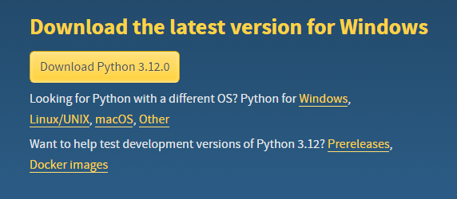
</p>

Click **```Download Python 3.12.0```**

### 2. Install Python .exe

<p align="center">
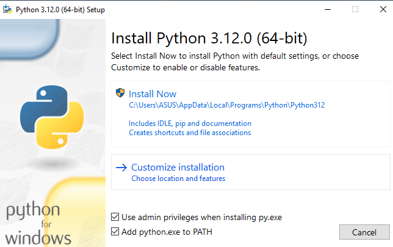
</p>


### !!! Pastikan Add python.exe to PATH diceklis !!!
Click **```Install Now```**

### 3. Test it

Buka Command Prompt  
1. Search cmd di windows   

<p align="center">
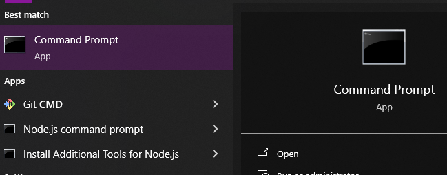
</p>

2. Buka cmd  

3. Ketik "python" dan enter  

<p align="center">
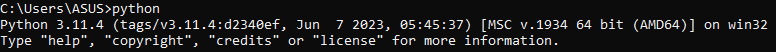
</p>

Jika seperti ini maka Python Berhasil diinstall 
<br>
<br>
  
## Adding Python and Pip Path

### 1. Get Python and Pip Path
Cari Python di Windows  
Click Kanan Python, Pergi ke folder lokasi  

<p align="center">
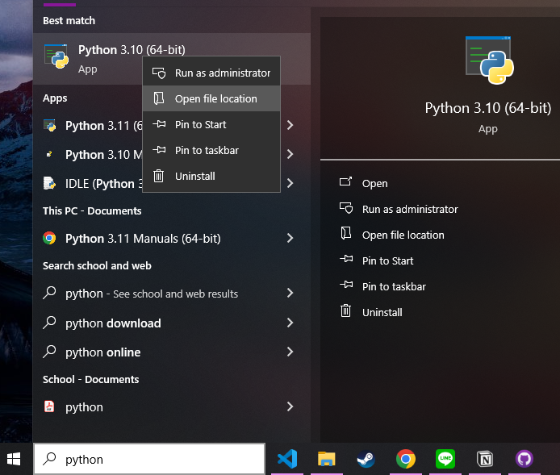
</p>

Masuk ke dalam folder yang terdapat shortcut untuk Python  
Click Kanan shortcut Python dan pergi ke folder lokasi  

<p align="center">
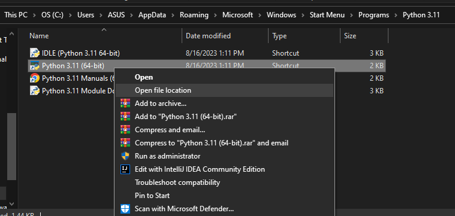
</p>

Jika Sudah dalam folder dengan file python yang merupakan aplikasi  

<p align="center">
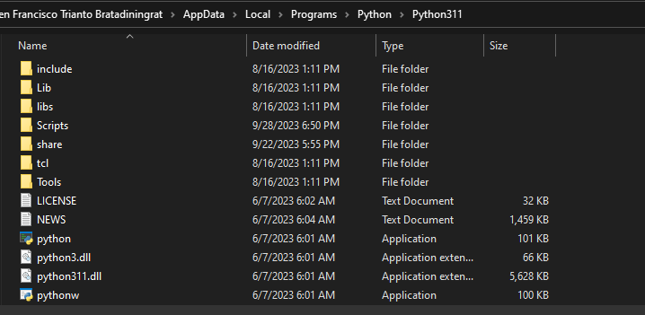
</p>

Click kiri search bar di atas sehingga terlihat Path  

<p align="center">
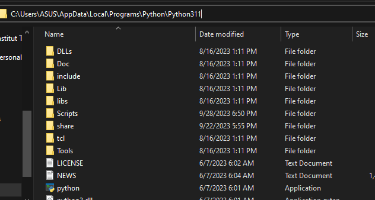
</p>

Simpan Path tersebut untuk digunakan di langkah selanjutnya

### 2. Buka Enviroment Variables
Cari Enviroment Variables di Windows  

<p align="center">
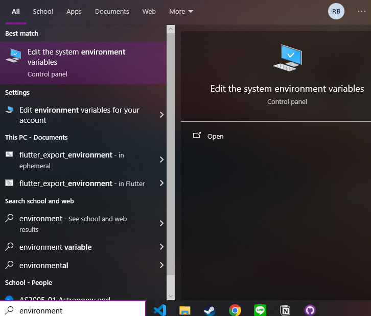
</p>

Buka Edit the system Enviroment Variables

<p align="center">
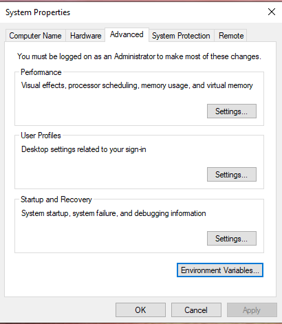
</p>

Masuk ke Enviroment Variables...  
Pada Bagian System Variables (tabel bawah)  
Cari Path dan click Edit

<p align="center">
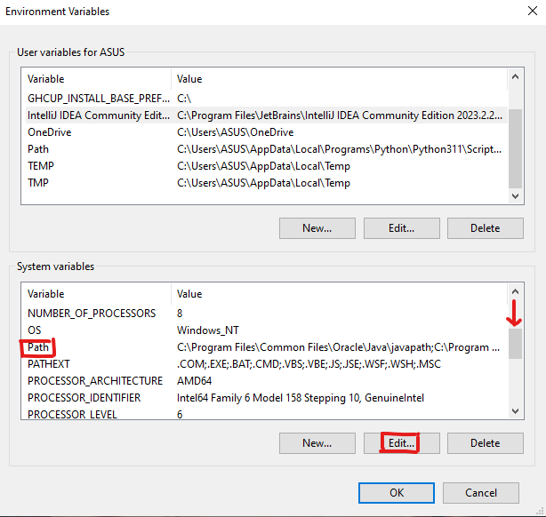
</p>

Click New dan paste path yang sudah ditemukan pada Langkah 1. sehingga menjadi seperti yang ada di gambar ini.  
Perhatikan ada path dipaste 2  
1. Path Python dengan ```...\PythonXXX\```
2. Path Pip dengan ```...\PythonXXX\Scripts\```  
XXX adalah versi dari Python

<p align="center">
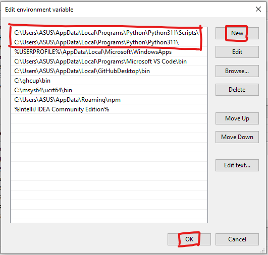
</p>

Click Oke dan test pada cmd   
Ikuti langkah [di sini](#3-test-it) untuk melakukan test